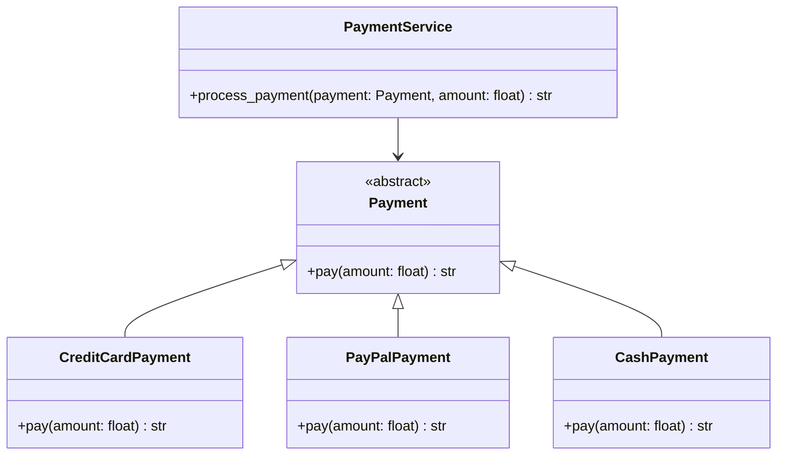
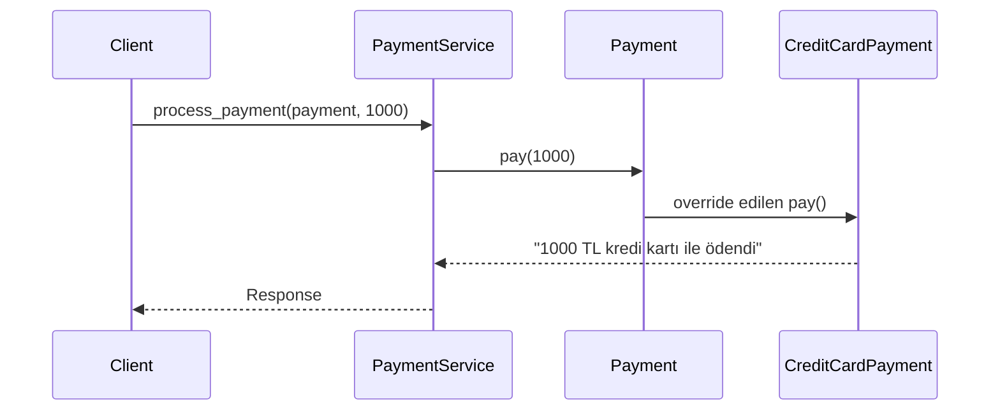

# 🧠 Nesne Yönelimli Programlama'da Soyutlama (Abstraction)


---

# 📌 İçindekiler

- Soyutlama Nedir?
- Neden Kullanırız?
- UML Class Diagram
- Sequence Diagram
- Python Örneği
- Polymorphism ile İlişkisi
- Proje İçinde Kullanımı
- Sonuç

---

# 1️⃣ Soyutlama Nedir?

**Soyutlama (Abstraction)**, karmaşık sistemlerin yalnızca gerekli yönlerini gösterip, gereksiz detayları gizleme prensibidir.

> “Ne yapılacağını göster, nasıl yapıldığını gizle.”

---

# 2️⃣ Neden Soyutlama Kullanırız?

Soyutlama:

- Karmaşıklığı azaltır
- Kod tekrarını önler
- Gevşek bağlılık (Loose Coupling) sağlar
- Open/Closed Principle’a uygunluk sağlar
- Test edilebilirliği artırır
- Sistemi genişletilebilir yapar

---

# 3️⃣ UML Class Diagram

Aşağıdaki diyagram, bir ödeme sistemi üzerinden soyutlamayı göstermektedir.



### 📌 Diyagram Açıklaması

- `Payment` soyut sınıftır.
- Alt sınıflar bu sınıftan miras alır.
- `PaymentService` sadece soyut tipe bağımlıdır.
- Concrete sınıflara doğrudan bağlı değildir.

Bu yapı **bağımlılığı azaltır** ve **esneklik sağlar**.

---

# 4️⃣ Sequence Diagram

Şimdi sistemin çalışma akışını görelim.



### 📌 Sequence Açıklaması

1. Client ödeme isteği gönderir.
2. Service soyut tipe çağrı yapar.
3. Runtime’da doğru concrete sınıf çalışır.
4. Sonuç geri döner.

Burada gerçekleşen şey:

- Soyutlama
- Polymorphism
- Dynamic Dispatch

---

# 5️⃣ Python Uygulama Örneği

## 🔹 Abstract Class

```python
from abc import ABC, abstractmethod

class Payment(ABC):

    @abstractmethod
    def pay(self, amount: float):
        pass
```

---

## 🔹 Concrete Sınıflar

```python
class CreditCardPayment(Payment):

    def pay(self, amount: float):
        return f"{amount} TL kredi kartı ile ödendi."


class PayPalPayment(Payment):

    def pay(self, amount: float):
        return f"{amount} TL PayPal ile ödendi."
```

---

## 🔹 Service Katmanı

```python
class PaymentService:

    def process_payment(self, payment: Payment, amount: float):
        return payment.pay(amount)
```

---

## 🔹 Kullanım

```python
service = PaymentService()

payment = CreditCardPayment()
print(service.process_payment(payment, 1000))
```

Service sınıfı **CreditCardPayment’i bilmez**.

Sadece `Payment` sözleşmesini bilir.

Bu soyutlamadır.

---

# 6️⃣ Polymorphism ile İlişkisi

```python
payments = [
    CreditCardPayment(),
    PayPalPayment()
]

for payment in payments:
    print(payment.pay(500))
```

Aynı metot çağrılır.
Farklı davranış oluşur.

Bu **Polymorphism**tir.

Soyutlama ise bu polymorphic davranışı mümkün kılar.

---

# 7️⃣ Proje İçinde Soyutlama

Gerçek projelerde:

- Repository katmanı
- Service katmanı
- Database katmanı
- Payment sistemleri
- Notification sistemleri

soyut sınıflar ile tasarlanır.

Örnek:

```python
class Database(ABC):

    @abstractmethod
    def connect(self):
        pass
```

Bu sayede:

- MySQL
- PostgreSQL
- MongoDB

kolayca değiştirilebilir.

---

# 8️⃣ Sonuç

Soyutlama:

- Yazılım mimarisinin temelidir
- SOLID prensipleriyle doğrudan ilişkilidir
- Büyük projelerde sürdürülebilirlik sağlar
- Test edilebilirliği artırır
- Bağımlılığı azaltır

---

# 🎯 Özet

Soyutlama şudur:

```
Ne yapılır? → Abstract Class
Nasıl yapılır? → Concrete Class
```

> Arayüz sabit kalır, implementasyon değişebilir.


# 👨‍💻 Author

GitHub: github.com/Meszn
