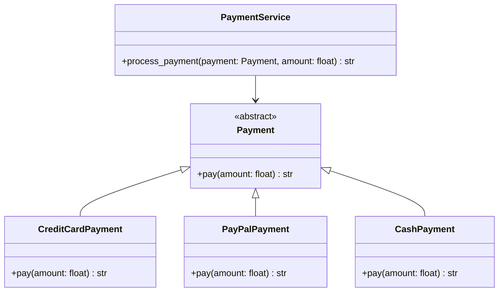

# 💳 FastAPI Payment System API  
### Abstraction & Clean Architecture Example


---

## Proje Amacı

Bu proje, **Nesne Yönelimli Programlama'da Soyutlama (Abstraction)** kavramını gerçek bir **FastAPI REST API** üzerinden göstermektedir.

Sistem farklı ödeme yöntemlerini destekler:

- 💳 Credit Card
- 🅿️ PayPal
- 💵 Cash

Tüm ödeme türleri ortak bir soyut sınıftan türetilmiştir.

---

#  Kullanılan OOP Kavramları

- Abstraction
- Polymorphism
- Open/Closed Principle
- Layered Architecture

---

# 🏗 Proje Mimarisi
 fastapi_abstraction_api/  
│  
├── main.py  
├── models/  
│ └── payment_request.py  
│  
├── payments/  
│ ├── base.py  
│ ├── credit_card.py  
│ ├── paypal.py  
│ └── cash.py  
│  
├── services/  
│ └── payment_service.py  
│  
└── requirements.txt  


---

# 📊 UML Class Diagram


# 🔍 Soyutlama Nasıl Çalışıyor?

## Payment soyut sınıfı:
```
from abc import ABC, abstractmethod

class Payment(ABC):

    @abstractmethod
    def pay(self, amount: float) -> str:
        pass
```

## Service katmanı sadece Payment tipini bilir:

```
class PaymentService:

    def process_payment(self, payment_method: Payment, amount: float):
        return payment_method.pay(amount)
```
Bu sayede: 
Service katmanı concrete sınıflara bağımlı değildir.Yeni ödeme türü eklemek mevcut kodu bozmaz.Sistem genişletilebilir.

# ⚙️ Kurulum
## 1️⃣ Clone
```
git clone https://github.com/kullanici_adin/repo_adi.git
cd repo_adi
```
## 2️⃣ Virtual Environment
```
python -m venv venv
```
## Windows:
```
venv\Scripts\activate
```
## Mac/Linux:
```
source venv/bin/activate
```
## 3️⃣ Install Dependencies
```
pip install -r requirements.txt
```
## ▶️ Uygulamayı Çalıştırma
```
uvicorn main:app --reload
```
# Swagger UI:
```
http://127.0.0.1:8000/docs
```
# 📬 API Kullanımı
```
POST /pay
Request Body
{
  "amount": 1000,
  "method": "credit"
}
Available Methods

"credit"

"paypal"

"cash"

Response
{
  "status": "success",
  "message": "1000 TL kredi kartı ile ödendi."
}
```
# ➕ Yeni Ödeme Yöntemi Eklemek

- payments/ klasörüne yeni sınıf oluştur
- Payment sınıfından miras al
- pay() metodunu implement et
- Factory yapısına ekle

Mevcut sistem değiştirilmez.Bu yapı Open-Closed Principle’a uygundur.

# 👨‍💻 Author

GitHub: https://github.com/Meszn
